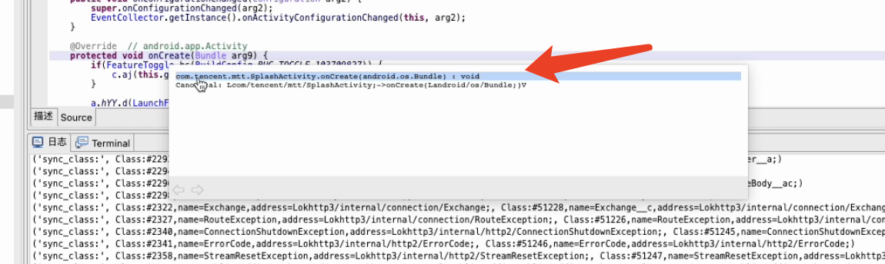
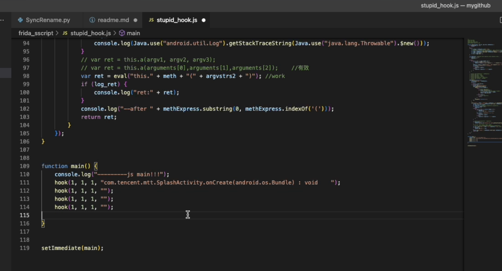
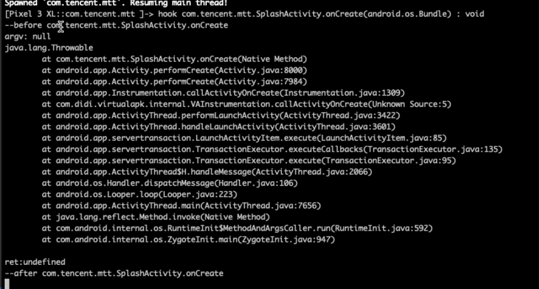

# frida_sscript

frida功能脚本，帮助动态分析提升效率
## stupid_hook.js：  
傻瓜式一键实现frida hook函数操作,配合jeb使用,成为真正的cv工程师。  
将鼠标悬停在jeb里面的函数上面，把弹窗的第一行贴出来。调用封装好的hook方法即可完成对方法的hook：  
>hook(1, 1, 1, "jeb中的方法表达式");  
参数1：打印函数参数  
参数2：打印函数返回值  
参数3：打印函数调用栈  
参数4：jeb中贴出的方法表达式

## 使用：  
1、jeb中复制方法表达式  
  
2、在脚本中调用封装好的hook函数  
  
3、frida用脚本hook应用，等待hook点触发  
